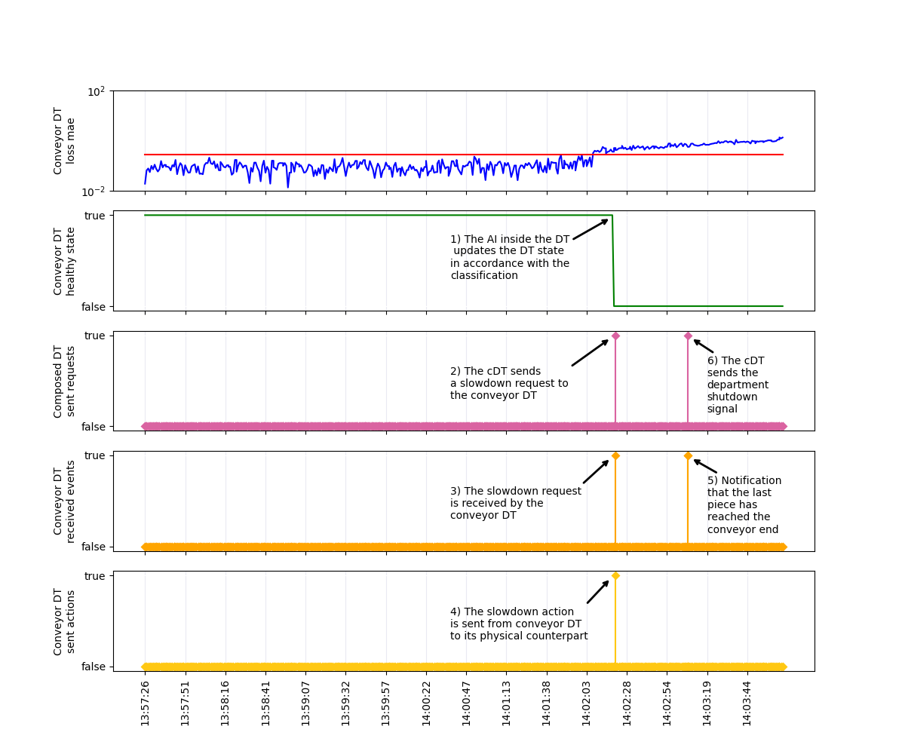

# Fischertechnik Multiprocess Department-Conveyor Health Model Experiment

[](https://www.python.org/downloads/)
[](https://tensorflow.org/)
[](https://github.com/your-username/fischer-multiprocess-conveyor-dt-intelligent-model-main)

An end-to-end experimental framework and log processing tool for **Cognitive Digital Twin (cDT)** architectures in smart manufacturing environments.

This repository processes, synchronizes, and visualizes real-time log data generated by two interacting Digital Twins operating on a **Fischertechnik Multiprocess Station with Oven**:
1. **Conveyor DT (Local)** – Embeds a Deep Learning LSTM Autoencoder model performing real-time bearing vibration anomaly detection.
2. **Composed DT (Department)** – Acts as a high-level cognitive coordinator orchestrating multi-agent fault propagation, local slowdowns, and emergency department shutdown procedures.


## 📌 Architecture & Overview

In a Smart Manufacturing Industry 4.0 context, Cognitive Digital Twins operate in a multi-level, orchestrated hierarchy. Local Digital Twins monitor individual physical assets, while the **Composed (Department) DT** acts as a higher-level cognitive coordinator that manages dependency graphs and propagates fault mitigation strategies across the whole production line.

```
                    +---------------------------------------------------------------+
                    |                  Composed DT (Department)                     |
                    |  - High-level Department Orchestration & Dependency Analysis  |
                    |  - Multi-agent Propagation & Emergency Shutdown Controller    |
                    +---------------------------------------------------------------+
                              ^                                   ^
                              | Local Anomaly                     | Propagated Action
                              | State Notification                | (Inherited Fault)
                              v                                   v
                    +-------------------+       +-----------------------------------+
                    |    Conveyor DT    |       |   Other Local DTs (Department)    |
                    |      (Local)      |       |  [Turntable | Saw | Oven | Vac]   |
                    +-------------------+       +-----------------------------------+
                              ^                   ^             ^                 ^
                    Sensor   | Physical   Sensor | Physical    | Sensor          | Physical
                    Vibration | Actions      Data | Actions     | Data            | Actions
                    (b1..b4)  |                   |             |                 |
                              v                   v             v                 v
                    +---------------------------------------------------------------+
                    |                  Fischertechnik Physical Line                 |
                    |           (Conveyor, Turntable, Saw, Oven, Vacuum)            |
                    +---------------------------------------------------------------+

```

### Cognitive Response & Fault Propagation Workflow
1. **Local Anomaly Detection:** The **Conveyor DT** collects 4-channel vibrational accelerometer readings (`b1`, `b2`, `b3`, `b4`) and runs an **LSTM Autoencoder**. If the reconstruction error ($MAE$) exceeds the threshold (`0.275`), it updates its local health state to `false` (faulty).
2. **Hierarchical Notification:** The Conveyor DT notifies the higher-level **Composed DT** of the detected local anomaly.
3. **Relational Analysis & Propagation:** The **Composed DT** evaluates the structural relationships and material flow dependencies between the Conveyor DT and adjacent workstation DTs (**Turntable DT**, **Saw DT**, **Oven DT**, and **Vacuum Carrier DT**).
4. **Targeted Reaction Commands:**
   - **Conveyor DT:** Receives an immediate **direct anomaly slowdown** request.
   - **Upstream & Downstream DTs:** Receive an **inherited anomaly stop** signal, ensuring coordinated clearance of in-flight workpieces before safely halting related physical machinery.
5. **Controlled Department Shutdown:** Once all active workpieces are safely routed to exit points (notified by light barriers), the Composed DT triggers a clean **department-wide shutdown**.


## 🔬 Experimental Scenario & Dataset

- **Hardware Scenario:** [Fischertechnik Multiprocess Station with Oven](https://www.fischertechnik.de/en/products/industry-and-universities/training-models/536632-multi-working-station-with-furnace-24v). Controlled by 24V Industrial Soft-PLCs ([RevolutionPi](https://revolutionpi.com/en/products/revpi-core)) connected via MQTT.
- **Digital Twin Library:** Built using the [White Label Digital Twin (WLDT)](https://wldt.github.io/) framework.
- **Dataset Source:** [NASA Bearing Dataset (Set No. 2)](https://www.kaggle.com/datasets/vinayak123tyagi/bearing-dataset?select=3rd_test) from Kaggle.
  - 4 bearing channels per entry.
  - 984 total time steps. Streamed via a dummy adapter simulating real-time physical streaming over a ~16-minute experiment run.


## 📁 Repository Structure


```

fischer-multiprocess-conveyor-dt-intelligent-model-main/
├── main.py                        # Execution script for log parsing, AI inference, and timeline plotting
├── requirements.txt               # Python dependencies
├── output/
│   └── graph/
│       └── breakdown-strategy-timeline.png # High-resolution output graph
└── source/
├── models/
│   ├── bearing-sensor-anomaly-detection.h5  # Keras LSTM Autoencoder model
│   └── scaler_data.bin                      # Pre-fitted MinMaxScaler
└── data/
├── conveyor-dt/           # Conveyor DT logs (vibrations, properties, interactions)
└── dept-composed-dt/      # Composed Department DT logs (interactions, properties)

```


## 📊 Sample Output

The generated timeline (`output/graph/breakdown-strategy-timeline.png`) visualizes the 6-step cognitive reaction cascade across time:



1. **AI Detection:** LSTM model MAE exceeds threshold $0.275$, updating Conveyor DT health to `false`.
2. **Slowdown Command:** Composed DT issues speed reduction request to Conveyor DT.
3. **Event Reception:** Conveyor DT logs receipt of slowdown event.
4. **Physical Actuation:** Conveyor DT commands physical motor speed reduction.
5. **Exit Clearance:** Exit light-barrier triggers notification when the last workpiece exits.
6. **Department Shutdown:** Composed DT issues final department-wide shutdown command.


## ⚙️ Installation & Usage

### 1. Clone & Setup Environment
```bash
git clone [https://github.com/your-username/fischer-multiprocess-conveyor-dt-intelligent-model-main.git](https://github.com/your-username/fischer-multiprocess-conveyor-dt-intelligent-model-main.git)
cd fischer-multiprocess-conveyor-dt-intelligent-model-main

python -m venv venv
source venv/bin/activate  # Windows: venv\Scripts\activate
pip install -r requirements.txt

```

### 2. Run Log Analysis

```bash
python main.py

```

---

## 📚 Publications & References

1. M. Martinelli, J. Zhang, A.-K. Splettstoßer, M. Picone, M. Lippi, and A. Wortmann, *"Hierarchical Digital Twin Ecosystem for Industrial Manufacturing Scenarios,"* 2024 50th Euromicro Conference on Software Engineering and Advanced Applications (SEAA), IEEE, 2024, pp. 56–63. [DOI: 10.1109/seaa64295.2024.00018](https://www.google.com/search?q=https://doi.org/10.1109/seaa64295.2024.00018)
2. R. Minerva, G. M. Lee, and N. Crespi, *"Digital Twin in the IoT Context: A Survey on Technical Features, Scenarios, and Architectural Models,"* Proc. IEEE, vol. 108, no. 10, pp. 1785–1824, 2020.
3. M. Martinelli, *"Smart Digital Twins nell’Industria 4.0,"* Ph.D. Dissertation, Università di Modena e Reggio Emilia, 2024. [Online Access](https://www.google.com/search?q=https://hdl.handle.net/11380/1339389)
